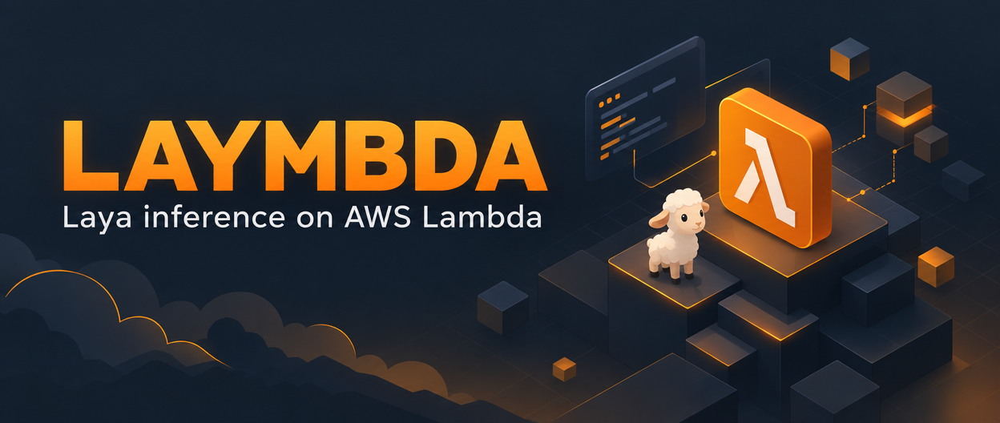
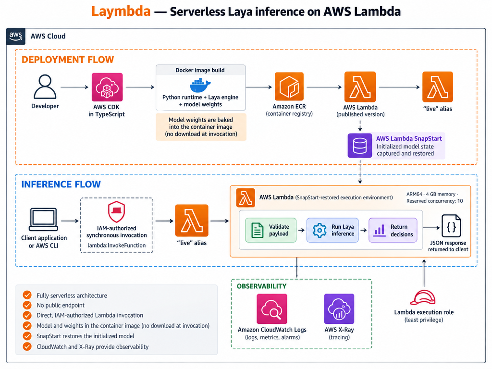

<br />
<p align="center">
  
  <br><br>
  <h2 align="center">Laymbda</h2>
  <p align="center">⚡ The <a href="https://github.com/NandhaKishorM/laya">Laya</a> engine running on AWS Lambda.</p>
</p>
<br>

## What's this ❓

Laymbda is an example of how to run the Laya System-1 decision model on AWS Lambda using a CPU-only, serverless architecture. It is backed by [Lambda SnapStart for container functions](https://docs.aws.amazon.com/lambda/latest/dg/snapstart-runtime-hooks-custom.html), which caches and restores initialized Lambda states quickly.

This project uses the [AWS Cloud Development Kit (CDK)](https://aws.amazon.com/cdk/) as the Infrastructure-as-Code layer, and requires Node.js, Docker, npm, and AWS credentials configured for the target account and region.

> All credit goes to the [Laya project](https://github.com/NandhaKishorM/laya).

## Architecture

Laymbda has no long-running servers. CDK packages the runtime as an x86-64 container image, Lambda loads Laya during initialization, and SnapStart captures the initialized process when CDK publishes a version.

<br />
<p align="center">
  
</p>

## 🚀 Quick Start

Run every command in this guide from the project root.

### Install

Install the project dependencies:

```bash
npm ci
```

### Bootstrap

Bootstrap AWS CDK in the target account and Region:

> Bootstrap is required per account and region only once.

```bash
npm run bootstrap
```

#### Deploy

AWS CDK builds the image during deployment using Docker, downloads the pinned Laya checkpoint, pushes the image to ECR, and publishes a SnapStart-enabled Lambda version behind the `live` alias.

```bash
npm run deploy
```

#### Invoke the model

Invoke the `live` alias with the included [support-ticket example](examples/support-ticket.json).

```bash
aws lambda invoke \
  --function-name "$(aws cloudformation describe-stacks \
    --stack-name LaymbdaStack \
    --query "Stacks[0].Outputs[?OutputKey=='LiveAliasArn'].OutputValue" \
    --output text)" \
  --cli-binary-format raw-in-base64-out \
  --payload fileb://examples/support-ticket.json \
  response.json
```

##### Response

The invocation response will be saved in `response.json`.

```bash
cat response.json
```

> See [Model invocation](docs/model-invocation.md) for the request format, question types, responses, and validation rules.

## 🧪 Benchmarks

The benchmark used a 4 GB Lambda memory configuration with the Laya model, example payload, and x86-64 runtime with FP16 weights. Sequential requests were sent to a single Lambda container with a maximum concurrency of one.

> AWS Lambda scales the number of vCPUs with the allocated memory.

> SDK retries were disabled for the benchmark.

| Metric | 4 GB x86-64 |
| --- | ---: |
| Warm average latency | 2.022 s |
| Warm p95 latency | 2.051 s |
| Warm p99 latency | 2.087 s |
| Client-observed average | 2.115 s |
| Per-container throughput | 0.470 req/s |
| Peak memory | 3,122 MB |
| SnapStart restore time | 2.445 s |

## 💰 Cost

The estimates use the measured warm duration of the 4 GB x86-64 function in `eu-west-1`. They exclude ECR, observability, data transfer, taxes, and Free Tier discounts. See the [AWS Lambda pricing](https://aws.amazon.com/lambda/pricing/) page for regional rates.

> Laymbda sets a [reserved concurrency](https://docs.aws.amazon.com/lambda/latest/dg/configuration-concurrency.html) to **10** by default, limiting simultaneous invocations and burst scale-out.

| Cost component | Price |
| --- | ---: |
| Lambda execution | $0.135 per 1,000 requests |
| SnapStart cache | $15.60 per active version per month |
| SnapStart restoration | $0.000559 per restored environment |

## 🧹 Cleanup

```bash
npm run destroy
```

Destroying the stack removes the function, published version, alias, log group, and runtime role. CDK bootstrap assets follow the lifecycle of the bootstrap environment and may remain cached for later deployments.
